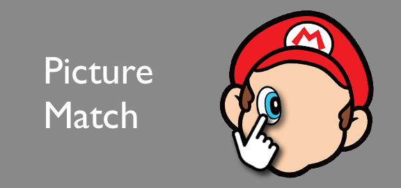

   

# Picture Match
An OpenGL application like pin-the-tail-on-the-donkey -- except adapted for screens.

## Table of Contents
* [Demo Gif](#demo)
* [Key Features](#key-features)
* [Example](#example)
* [Installation](#installation)
* [Built with](#built-with)
* [Project Status](#project-status)

## Demo

## Key Features
* Texture Mapping - Play around with vector graphics by rotating or moving 
* Texture Transformation - Rotate the eyes, ears, etc with 'J' or 'K' keys
* View Control - Resizing the window does not warp the graphics

## Installation
Picture Match uses Eigen, glad, and GLFW as submodules. To pull submodules with the project, add the argument --recurse-submodules.
`git clone --recurse-submodules https://github.com/jennarim/Picture-Match.git`

The project is compiled using CMake.
`
cd Picture-Match/
mkdir build
cd build
cmake ..
make`

Lastly, run the project with this command.
`./pictureMatch`

## Example
1. The picture of the desired image is initially shown to the player, alongside other instructions.

2. The face parts are placed and rotated randomly outside the face the user should drag the parts to.

3. The user can rotate any of the face parts as they select it.

4. Each face part will be bound to follow the user’s cursor.  The moment the user clicks inside the face, then the user has finalized the location.

5. Once all face parts have been finalized, the final result is shown.

6. The user can press R to restart, and continue to play and admire the result.

## Built With
* [OpenGL](https://www.opengl.org/) - the most widely adopted 2D and 3D graphics API in the industry
* [glad](https://glad.dav1d.de/) - an OpenGL loading library
* [Eigen](https://gitlab.com/libeigen/eigen) - a C++ linear algebra library
* [GLFW](https://www.glfw.org/) - an OpenGL library for creating windows and receiving input and events

## Project Status
This project is currently finished. 

